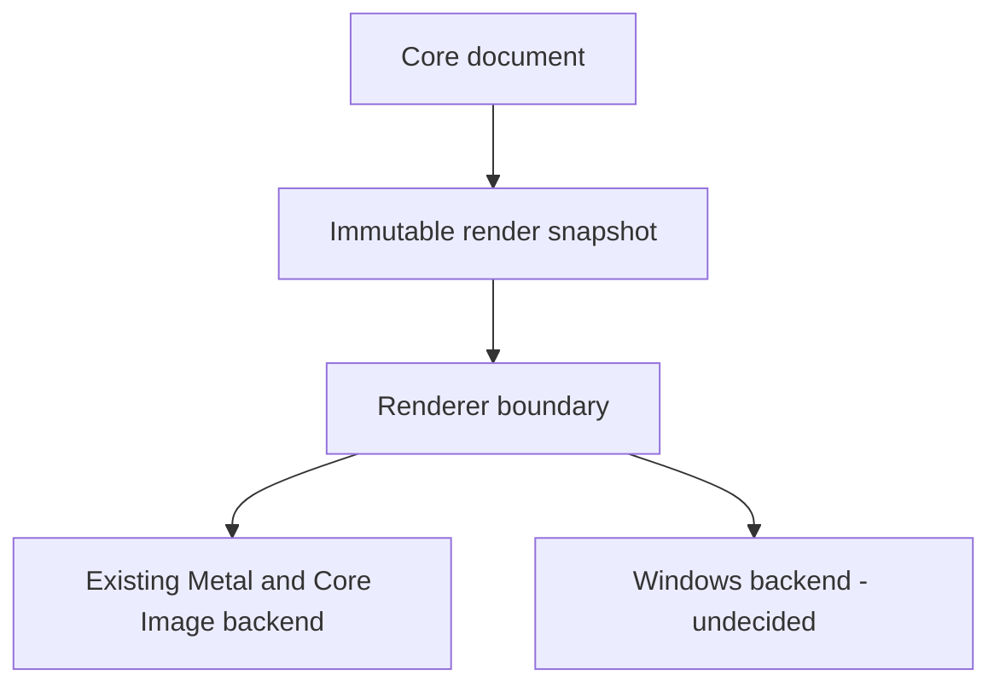

# Language-independent Core API contract

Status: semantic design only, audited on 2026-09-30. No product API, ABI, language,
GPU backend, allocator, mutex/actor/queue or storage implementation is selected.
This document supersedes the implementation choices recorded in `841d09c`; that
commit remains historical evidence, not authorization to rewrite the model.

The source baseline is the main synchronization merge **db268a2b** on
`Compositor-Multiplatform`, containing **main ccf062ed** (1.4.5(A), build 41,
`.comp` versions 1–12). The former v11 baseline `841d09ce` is historical.
See [repository evidence](multiplatform/repository-evidence.md) for exact scope,
CI limitations and preservation checks. This refresh describes the imported Mac
behavior; it introduces no independent format extension or Core migration.

**Observed** below describes inspected source. **Contract** defines required
meaning for a future boundary. **Open** marks implementation or compatibility
questions in [architecture-questions.md](multiplatform/architecture-questions.md).
Names are working vocabulary, not permanent public identifiers.

## 1. Document contract

| Data | Semantic contract and observed source |
|---|---|
| Identity | Persistent `DocumentID`, distinct from the identity of an open instance. `CanvasDocument.id` is a UUID; resize/crop preserve it. Opening the same package twice may give two instances with the same persistent ID. |
| Dimensions | Integer document pixels, each 1–30,000. A dimension change is an explicit canvas/image/crop operation, not a UI field write. |
| Resolution | Finite pixels/inch, 1–9,600; absent legacy field resolves to 72. |
| Color | Preserve the six `DocumentColorProfile` identifiers. A CMYK project currently edits RGB pixels in sRGB and converts for JPEG export. Imported asset profile, working profile and display profile are distinct. Color conversion is a platform/render service. |
| Layers | Stable identities, bottom-to-top sibling order, parent links and typed content (§2). No live mutable array is exposed. |
| Selection | Optional path plus antialiasing and feather distance. Absent means unrestricted editing; present but empty means touch nothing (`Selection.swift`). Part of history, not serialized. |
| Guides | Stable guide ID, horizontal/vertical axis, finite position within ±1,000,000 document pixels, ≤1,000 guides. Serialized from version 8; undoable. |
| Active layer | Optional valid layer ID, saved by `ProjectManifest` and restored by history. It is currently `EditorSession` state beside the document; the boundary must carry this edit context without conflating it with multi-selection in the panel. |
| Metadata | Format identifier/version/defaults belong to the format adapter. File URL, watcher state, save destination and UI metadata belong to the application session. Unknown fields follow the existing reader's behavior; lossless unknown-field retention is not currently promised. |
| History | Session-only undo/redo with names, saved-state tracking and retention budget (§12). Opening/reloading resets history; exporting a derivative does not mark the project saved. |
| Lifetime | An open instance owns mutable state and its history until closed. Closing prevents future operations; already retained immutable snapshots/content remain usable until released. Save/job completion must target the same open instance, not just a matching persistent UUID. |

`EditorSession.swift`, `EditorSession+Projects.swift`, `Guides.swift`,
`ColorProfile.swift` and `ProjectStore.swift` are the baseline evidence.
Creating a replacement canvas is itself undoable in `HistoryTests`; the session's
history can hold `CanvasDocument?`, including the pre-document state. A future
per-document object must preserve that session behavior via an explicit adapter;
closing a session is not an undoable close operation.

Viewport, zoom, collapsed folders, panel multi-selection, tool settings, dialogs,
image/mask editing focus and in-progress gestures stay outside shared state.

## 2. Layer contract

| Field | Meaning |
|---|---|
| Stable ID | Unique among layers in its document; unchanged by rename, reorder, placement, visibility or content edits. IDs are values, never addresses. |
| Name | Unicode text. Observed UI rename trims surrounding whitespace and ignores empty names. Serialized names must be nonblank and ≤16,384 UTF-8 bytes. The boundary rejects unsavable names; the UI may retain its existing normalization/no-op behavior. |
| Visibility | Own flag plus derived ancestor visibility. Do not rewrite children's flags when hiding a folder. A clipped layer hides with its hidden lower sibling base in the same parent. A live mask sourced from above or another parent remains usable when its source is hidden; this is not a blanket source-visibility rule. |
| Opacity/blend | Finite 0–1 own opacity; folder opacity multiplies per descendant. Folders remain pass-through, blend Normal. Preserve all 24 baseline blend names. Do not substitute isolated group compositing. |
| Placement | Origin, size, clockwise rotation around the center, flips and sampling. This is saved separately from pixels. Derive an affine transform for consumers (§7). |
| Hierarchy | Optional existing folder parent; no cycles, missing/non-folder parents or excessive depth. Sibling order is independent of the physical container chosen internally. |
| Content | Optional immutable image reference: absent on a blank pixel layer until painting, also absent on folders and adjustment layers. No GPU object or `CGImage` is part of the shared contract. |
| Mask | Optional immutable Gray8 coverage, enabled/link flags, optional independent placement. White reveals, black hides; a uniform 1×1 mask is valid. Folder masks modulate descendants. Disabled masks retain their data. |
| Clipping | Optional source layer identity; validate the graph and chain limits. Distinguish source coverage from display visibility and contiguous-stack UI rules. |
| Adjustment | Kind plus validated settings. Baseline has 12 kinds; preserve every stored parameter and defaults, including Levels/Curves child records omitted from the old inventory. |
| Effects | Nine optional typed effect slots in the fixed reference order, with enable flags and per-effect blend modes; bevel has highlight/shadow modes. Contour/pattern/texture parameters and Fill Opacity are semantic data (§2.1), not renderer objects. |
| Shape/text | Editable semantic style plus authoritative saved raster fallback. Shape fill/stroke/outside-stroke geometry remains additive metadata; absent `strokeOutside` retains legacy inside-stroke appearance. Text spans use UTF-16 code-unit offsets; the boundary's string encoding must not reinterpret those offsets. Rasterizing an edit drops stale editable metadata as existing operations do. |

Observed storage is `ImageLayer` in `EditorSession.swift`, a flat value array with
`parentID`, `ImportedImage`, styles and masks. The contract does not require that
layout, nor the spike's nested tree or six-mode blend enum. Geometry/graph/range
limits come from `LayerTransform.isValid`, `LayerHierarchy.validate`,
`LiveMaskGraph.validate`, `LayerAdjustment.isValid` and `ProjectStore.validate`.
Do not assume all existing validators cover every optional style uniformly.

### 2.1 Layer Style meaning at the synchronized v12 baseline

`LayerEffects` now contains the original six effects plus `BevelEffect`,
`SatinEffect` and `PatternOverlayEffect`, and optional `fillOpacity`. Preserve
stored absence independently from a default value: missing `enabled` means true,
missing effect blend mode means Normal, missing fill means 1, and missing bevel
Contour/Texture enable flags mean false. UI creation defaults are a different
policy: new shadows/satin use Multiply, glows use Screen; bevel has separate modes.

- Fill Opacity fades source pixels **without fading the effects**. Layer opacity
  remains the opacity of the composed layer; do not replace one with the other.
- Each effect blends with pixels/effects underneath it **within the same layer**,
  not directly with document layers beneath. Fixed bottom-to-top order: drop
  shadow, outer glow, outside stroke, source pixels, pattern overlay, color
  overlay, satin, inner glow, inner shadow, inside/centered stroke, bevel.
- Bevel carries style/technique, depth/direction, size/soften, lighting,
  gloss/highlight/shadow, Contour and Texture settings. Contour and Texture are
  subfeatures of bevel, not new layers or arbitrary effect-list entries.
- `EffectContour` has 11 stable string cases; `EffectPattern` has eight procedural
  patterns. Pattern placement is anchored in layer pixels. Render snapshots must
  retain the same pattern origin through padding, preview scale and tiled redraws.
- Disabled effects retain settings and still participate in serialization,
  duplication and history. `visible` is a derived render projection, never the
  record to serialize in place of the original effects.

Scalar ranges, optional-field presence, enum strings and defaults follow
`LayerEffects.swift` and [project-format.md](project-format.md). Renderer dispatch
(`needsStyleRenderer`) is not a shared document property. Numerical output parity
for contours/patterns and renderer fallbacks needs evidence, not a GPU choice.

## 3. Operations and atomicity

Every requested change uses stable IDs and explicit values/policies. Validate the
whole request before publishing a new state. A recoverable failure changes
neither state, active edit context, redo history nor saved status. Duplicate IDs
in batch input are errors, not silently deduplicated. This is a future boundary
guarantee, stronger than some current UI helper functions; adapters preserve
intentional UI no-ops and partial-import reporting rather than exposing those
helpers verbatim.

| Operation | Meaning and reference |
|---|---|
| Create document/layer | Validate geometry/kind/parent/position, allocate fresh identities. Adding a layer selects it. Blank layers defer pixels. |
| Duplicate | New IDs for each copied root/descendant, share immutable content, remap internal parent/clipping links, preserve valid external links for same-document copies. Normalize selected ancestor+descendant roots once. `SelectionClipboard.insertCopy` and `copiedLayerIDs` define the reference ordering/naming. |
| Delete | Remove roots and descendants. Explicit bake/unlink policy for surviving clipping dependents; pixel baking is prepared outside Core and committed atomically with deletion. `LiveLayerMask.deleteWithLiveMaskChoice` currently contains the dialog. |
| Move/reorder | Specify destination parent and sibling position with an unambiguous before/after-removal convention. Reject cycles/depth errors. Existing `placeLayer` releases clipping that no longer fits the contiguous stack. |
| Group/ungroup | Mac grouping accepts roots from different parents and uses the deepest common parent/topmost branch; selected folders retain descendants. **Empty Mac selection creates an empty folder**. Spike grouping instead rejects empty/non-sibling input. Preserve the Mac command via create-folder or group intent, not the spike restriction. Ungroup preserves child order and revalidates clipping. |
| Rename/visibility/opacity/blend | One or several IDs; preserve folder restrictions and unchanged-value no-ops. Swipe/slider gestures can group multiple changes into one history step. |
| Placement | Validated placement(s); linked masks follow, unlinked placements remain explicit. Arbitrary affine shear must not silently become stored `LayerPlacement`: today's decomposition drops shear in `placing`. |
| Content replacement | Commit immutable pixels and any resulting bounds/style changes together. Brush/filter/image-size work is prepared from a snapshot, not an in-place mutation of retained history pixels. |
| Mask | Add/remove, enable/disable, link/unlink, place, replace pixels, or apply to pixels. Applying consumes prepared pixel output; linking transitions preserve the current visual placement. |
| Settings | Replace validated adjustment/effect/text/shape values, preserving inactive settings and hidden-effect parameters. Style commit changes effects, layer opacity and blend mode together; copying one effect does not copy Fill Opacity or layer opacity/blend. |
| Selection/guides | Set/clear selection and guide CRUD are undoable; rasterizing paths and finding subjects are services outside Core. |
| Undo/redo | Restore the recorded state and active layer (§12). No command replay requirement. |

Names, exact signatures and whether specialized multi-layer calls share a generic
batch envelope remain open. Successful no-op edits retain redo and state identity.
Large multi-step user intentions have a transaction boundary; nested transactions
produce one outer entry. No transaction implementation or new cancel API is
introduced now (§12).

## 4. ID semantics

| Question | Contract; compatibility evidence |
|---|---|
| Generator | Core creates IDs for new entities; loading validates supplied persisted IDs. Random UUID-compatible generation is a candidate, not a selected API/library. Existing app constructors use `UUID()`. |
| Uniqueness | Layers unique within a document; guides unique in their own collection. There is no existing global cross-document uniqueness validator. |
| Duplicate | Always fresh layer IDs, including descendants; reference map is returned as a bulk result. |
| Undo/redo | Restore the same original IDs, including deleted/recreated layers. |
| Save/load | Preserve UUID values and canonical filename mappings; current `<UUID>.png` and `<UUID>.mask.png` names stay unchanged. |
| Cross-document | Equal persistent IDs can exist in independent open instances. Consumers key live objects by instance + entity ID. Copy/paste between documents assigns fresh IDs and remaps links; `ProjectWorkspace.copyLayers` bakes external raster links and drops unsupported external adjustment links. |
| Deleted IDs | Never intentionally assign a deleted identity to a different entity during an instance lifetime. Undo resurrection is not reuse. Existing UUID generation provides practical freshness, not a checked tombstone registry. |
| Invalid ID | Unknown/foreign/stale entity ID returns a structured recoverable error; no partial edit. Close/reopen invalidates the instance handle even if the file UUID matches. |
| Duplicate input/file IDs | Reject batch duplicates before mutation. Reject duplicate serialized records before installation. `group([a,a])` was the spike crash regression in both implementations. |

`.comp` already uses UUIDs; the spike's incrementing `UInt64` is experimental and
**not** the product identity representation. Its counter is included in copied
history state, so undo followed by a fresh edit can reuse an experimental number.
Do not infer session uniqueness from that spike. No persisted representation is
changed; generator/handle-generation policy is Q1/Q12.

## 5. Ownership and lifetime

| Value/resource | Ownership rule |
|---|---|
| Open document | Session holds an owned Core instance/handle. Mutations are serialized by its owner context. Closing invalidates operations and detaches UI/jobs. |
| Layer | Owned by document state; callers keep IDs or snapshot values, never an address into the live collection. |
| Input string/array | Borrowed only for the call unless an explicit ownership-transfer operation is specified. Retained values are copied or retained immutably before returning. |
| Output strings/rows/settings | Owned by the returned snapshot/result; borrowed views expire when that owner is released. Explicit copies remain independent. |
| Content and masks | Immutable shared logical resources retained by live state, snapshots and history. Reference lifetime is explicit; allocator, tile shape, reference-count primitive and physical CPU storage owner remain open. |
| Effect/text/shape data | Value data or immutable shared records with the same snapshot lifetime. No mutable UI/platform object embedded in them. |
| Snapshot | Caller-owned immutable read view. Survives later mutation, undo/redo, deletion and document close. All reachable resources stay alive. |
| ABI result/error memory | If C ABI is selected, one explicit owner and matching release operation, or caller-owned copied output. Never free library allocations with a foreign allocator. Error lifetime must be documented too. |

UI/renderer may retain snapshots and image handles, but cannot keep unowned live
pointers/references across calls. A borrowed row inside a retained snapshot stays
valid through mutations; a released snapshot makes its borrowed rows invalid.

Potential zero-copy imports require immutable buffers plus a release obligation
whose invocation context is defined. Thread-affine destruction must be marshaled
by the platform adapter. GPU textures and native image wrappers have separate
renderer/platform lifetimes; they are not history state. Tile/pixel views, if
exposed later, must describe format, row stride, dimensions and lifetime explicitly.

## 6. Bulk reads and snapshots

Observed: both `cc_outline_row` implementations reconstruct the whole outline,
and C# loops over rows. That is O(n²) work; the saved 2,000-layer reports show
334.7 ms (Swift) and 24.2 ms (C++), not a measurement of a bulk product API.
Neither result chooses a Core language. The later isolated CoreBoundary experiment
implements only a synthetic bulk snapshot; no product bulk API is implemented.

| Candidate | Benefits | Costs/open points |
|---|---|---|
| Immutable document snapshot | Consistent state for renderer/save/jobs and explicit lifetime; natural match for current value snapshots | Retained versions consume memory; choose copying/sharing after measurements |
| Layer-list snapshot | One compact panel read, ordering/visibility derived once | Must share the same state/generation as richer reads; avoid a second authoritative model |
| Batch properties by ID | Efficient inspector updates and sparse selections | Define absent IDs/order, per-field lifetime, whole-batch error rules; not sufficient alone for rendering |
| Versioned immutable view | UI detects stale results without holding live references | Distinguish state identity from publication generation (§8) |
| Change set/delta | Cheap incremental panel/cache refresh | Retention, ancestor effects, removals and overflow/reset are complex; full-snapshot fallback required |

**Contract candidate for initial implementation:** an owned immutable document
snapshot plus one bulk layer-table view derived from it. Existing `ProjectSnapshot`
is a serialization snapshot, not this complete read model: it omits selection and
history context. The panel projection may expose ID, name, parent/depth, kind, own
and effective flags/opacity; renderer projection adds content, masks and settings.
Document order and panel top-first order must be explicit, and collapse remains UI.

One materialization per snapshot/projection; subsequent row indexing must not
rebuild the collection. Whole-table traversal is linear in returned data, not
quadratic. Sharing pixels is required semantically; O(1) snapshot creation or a
particular persistent container is not promised without implementation evidence.

Deltas are optional after the basic view is proven: include source/target
generation, added/removed/changed IDs and document changes. Ancestor visibility,
opacity or clipping changes must invalidate affected descendants. Unknown/expired
base generation yields `fullRefreshRequired`, never an incomplete delta. Numeric
latency budgets require a named machine, build mode, workloads and percentiles
(Q6); former unmeasured <5 ms/<0.1 ms targets are not validated guarantees.

## 7. Platform-independent values and adapters

| Candidate | Semantic data |
|---|---|
| `CoreScalar` (formerly `Scalar`) | Finite IEEE binary64 where stored; exact range/rounding rules come from each field, not a global clamp |
| `CorePoint`, `CoreSize`, `CoreRect` | Coordinates/extents in document pixels, top-left origin, y downward |
| `CoreTransform` | Affine a,b,c,d,tx,ty: (x,y) → (a*x+c*y+tx, b*x+d*y+ty); explicit concatenation order and singular-inverse failure |
| `LayerPlacement` | Origin/size, clockwise rotation **in degrees**, flip flags, sampling; not an arbitrary affine matrix |
| `CoreColor` | Finite components plus explicit working/encoded color interpretation; opacity is separate where existing records make it separate |
| `ColorSpaceID` / optional profile reference | Stable format identifier; immutable profile metadata/bytes when a service needs them. Do not silently retag imported pixels or treat CMYK working buffers as CMYK channels. |
| `CorePath` | Move/line/quad/cubic/close elements and defined fill semantics. Current selection coverage uses nonzero winding; even-odd support would need evidence, not an accidental change. |
| `ImageRef` | Immutable logical identity, dimensions, pixel format/alpha convention, resource accounting and read access through an explicit adapter |
| IDs/text | UUID-compatible entity values, Unicode strings, UTF-16 text span offsets |

No dependency on `CGFloat`, `CGPoint`, `CGSize`, `CGRect`, `CGAffineTransform`,
`CGPath`, `CGImage`, AppKit, SwiftUI or Windows/GPU SDK types. Simple settings do
not become unshareable merely because their source file imports AppKit; distinguish
stored types, convenience methods and file imports in the inventory.

Apple geometry/path/image conversions belong to `Platform/macOS` adapters and
renderer extensions; Windows conversions belong to corresponding Windows adapters.
Current `ImportedImage`/`RasterSnapshot` can remain behind the Mac image adapter.
Do not require a shared image to depend on that Mac implementation. Core numerical
helpers must not call `BrushRaster` for affine construction or a UI type for color
conversion. Preserve schema numbers/enum raw values with semantic round-trip tests.

## 8. Threading, generations and stale work

| Concern | Rule |
|---|---|
| Mutation | One serialized owner execution context per open instance. Default UI owner is compatible with Mac; a background-owned instance is also valid. No actor, mutex or queue is selected. |
| Undo/redo/close | Same owner rules as other mutations; no simultaneous history edits. |
| UI read | May obtain a snapshot on the owner context and read it without later access to live state. |
| Background read | Read retained immutable snapshots only. Snapshot handoff must have a defined synchronization boundary. |
| Renderer concurrent with editing | Keeps its own retained snapshot; reads never observe a half-applied operation. A newer published snapshot can replace it; an older one remains valid. |
| Background result | Carries open-instance identity and source generation. Default stale commit is rejected; operation-specific rebase requires a separately reviewed policy. Validate more than merely whether the target ID still exists. |
| Affinity violation | Detectable wrong-owner calls are programmer errors returned as a status where possible, not allowed to race. Enforcement mechanism is open. |
| Several documents | Independent contexts; color/job inputs come from the target document/snapshot, not the front tab's global state. |

**Two tokens are needed, by meaning:**

- `StateID`: identity of committed history state. New meaningful edit creates one;
  undo/redo restore recorded IDs. Saving state S marks S saved, so undo back to S
  becomes unmodified. This matches `DocumentHistory.revision/savedRevision`.
- `Generation`: changes whenever externally observable instance state is published,
  including undo/redo, active-context updates and visible transaction previews.
  Prevents A→B→A from making stale asynchronous work appear current. It is not
  serialized or restored by undo. It is a **new boundary requirement**, absent from
  the existing history API, not a claim that current code implements it.

A snapshot identifies its open instance, state and generation. Transaction previews
must be explicitly marked uncommitted. **Future contract:** normal save captures
committed state or waits for an explicit resolution. **Observed gap:** Layer Style
preview mutates the live document without advancing history; `canStartProjectOperation`
does not include `layerStyle`, and `ProjectController.begin/prepareSave` does not
finish it. Do not claim the current app universally excludes preview state from
saving. Save/Cancel/OK traces and exact preview/cancel envelope are Q16; this sync
preserves main and does not fix that behavior.

## 9. Error contract

| Input/failure | Classification and behavior |
|---|---|
| Unknown/stale layer ID | Recoverable domain error (`notFound`); state/history unchanged |
| Repeated ID in a batch | Recoverable invalid-request error (`duplicateID`); reject before mutation |
| Cyclic parent, invalid target kind, impossible operation | Recoverable domain error with relevant IDs/field |
| Nonfinite/out-of-range value | Recoverable validation error, not silent coercion; UI normalization stays explicit |
| Malformed serialized metadata, duplicate file IDs, bad reference or missing asset | Corrupted document/input; reject candidate load, keep open document unchanged |
| Newer format or unsupported feature/pixel format | Recoverable unsupported capability/version; no silent flatten/drop |
| Wrong owner, closed instance, invalid argument shape | Programmer misuse; return error for representable/checkable misuse. Arbitrary invalid native addresses cannot safely be validated by an in-process ABI. |
| Allocation/I/O/cancellation/stale job | Recoverable where the runtime permits reporting before mutation; no promise that every runtime OOM is catchable |
| Broken internal invariant | Internal bug, not user input; do not continue mutating potentially corrupt state. Fail-stop/invalidate safely, diagnostic capture and platform recovery policy needed. |

Candidate transport: stable status/category + structured error (operation, field,
IDs, diagnostic message) or an owned result object. UI localizes messages. Synchronous
error callbacks risk reentrancy/lifetime problems and are not the default candidate.
Exact codes, ABI layout and owned-vs-copied error storage remain Q12.

No language exception/error object crosses a foreign boundary. `catch` does not
make memory corruption or Swift traps recoverable. Spike `SafeHandle` is useful
ownership evidence, not handle validation or process isolation. Inspection also
finds C++ allocations outside `guarded` (`cc_group`, `cc_rename`) and unguarded
undo/query paths; the spike has not proved complete exception containment. Preserve
it as evidence; future boundary tests need invalid/duplicate IDs, UTF-8/lengths,
closed handles, fault injection and atomicity, not just happy paths.

## 10. Serialization and service boundaries

| Boundary | Core / shared semantic responsibility | Adapter / service responsibility |
|---|---|---|
| `.comp` | Validated document/record meaning, IDs, ranges, references and compatibility policy | Formats layer maps records/defaults/version gates; JSON codec choice is open. Platform handles folders, PNGs/profiles, path safety, limits, atomic replacement and watching. |
| UI | Read snapshots and explicit operations | Input, selection context, panels, localization, dialogs and gesture policy |
| Renderer | Immutable render description (§11) | Compositing, rasterization, GPU resources, caches and display conversion |
| Clipboard | Validate imported semantic records, fresh-ID remap, explicit external-link policy | OS clipboard, encoded data, copy-across-document coordination |
| Import/export | Accept validated candidate layers/content; expose snapshot for output | PSD/image codecs, profile conversions, missing-font reports, flattening and filesystem writes |
| Autosave/recovery | Supply consistent snapshot + state/instance token | Scheduling, atomic storage, recovery retention and reopen prompts. No new autosave behavior is claimed or introduced. |

The synchronized reader supports 1–12. `ProjectManifest.current` is 12 and
`compatible` is 11. `ProjectStore.save` rewrites a current-version manifest to
`neededVersion`: 12 if any effects record `usesLayerStyle`, otherwise 11. An
explicit older version is left alone and validated. This is not a general search
for the minimum among versions 1–12. The version-12 check validates `effects.isValid`
and rejects Layer Style fields in versions 1–11.

`usesLayerStyle` tests **presence**, not just visual activity: a disabled bevel,
explicit Normal blend mode, `centered: false`, zero Spread or `fillOpacity: 1`
can still require v12. `needsStyleRenderer` instead checks visible/render-active
requirements. Do not use it to select a save version or drop inactive fields.
Removing all v12 fields can return a subsequent save to v11. Shape fill/stroke/
`strokeOutside` remain additive fields, not v12-gated; do not strengthen this gate
accidentally. No independent format changes are introduced by this refresh.

The PSD service separately writes editable `TySh` text, `lfx2` styles and `iOpa`
fill when representable. Procedural Pattern Overlay and bevel Texture have no
editable PSD form here and cause raster fallback with notes; flattening can also
be requested. The reader maps supported descriptors, not every Photoshop feature.
These compatibility/capability decisions belong to the format adapter, not a
Core language or a renderer backend. Core keeps the full `.comp` semantic data.

Compatibility means parsed metadata including IDs, defaults and enum strings,
asset mapping, decoded pixels/alpha/profiles, and appearance where specified.
JSON key order/whitespace and PNG compression bytes need not match. Use byte
comparisons where bytes are the contract; do not use whole-package byte equality
as a universal fixture rule.

Load validates/decode-completes before installation. Save failure leaves the prior
package intact. An asynchronous save marks **the captured StateID**, so later edits
stay dirty (`ProjectController.prepareSave/write`). Current loading uses in-memory
asset bytes to keep undo images independent of files later replaced on disk; a
future adapter must preserve that lifetime property.

## 11. Renderer boundary

Required read data: dimensions, coordinate convention, working color interpretation,
ordered hierarchy, own/derived visibility and opacity, blend modes, placement,
immutable content, mask values/placement/enabled/link flags, clipping dependencies,
adjustment settings, all nine effect settings in fixed order, Fill Opacity,
per-effect blend modes/contours, bevel texture and layer-local pattern origin,
text/shape fallback content and styles.
Selection/guides may be a separate overlay projection of the same generation.

Do not flatten folder/mask/adjustment semantics to an unordered list or reduce
clipping to a visibility flag. Renderer owns caches, textures, synchronization and
rasterization; it cannot mutate document state. Cache keys include relevant state,
image identity, parameters and color/scale inputs; undo may reuse immutable content
but does not guarantee every cached result is valid. Cache eviction never destroys
history-owned data. Backend API and render-pass layout remain open; no DirectX or
Vulkan implementation is part of this contract.

Observed Mac dispatch retains `MetalLayerEffects` for legacy effects and uses the
floating-point CPU `LayerStyleRenderer` for newer active requirements. Preview,
brush dirty-region surface and full-resolution export all consume these settings.
Both implementations and their caches stay renderer/platform responsibilities;
the new CPU implementation is not pulled into Core merely because it is CPU code.

## 12. Undo/redo semantics and language decision factors

**Observed** `DocumentHistory` keeps before/after value snapshots (including active
layer and revision), not inverse commands. Swift arrays use copy-on-write;
`ImportedImage` shares immutable `CGImage` references; `RasterSnapshot` keeps base
and patches and materializes lazily. Copy-on-write does not mean zero metadata
copies or guaranteed constant-time edits. The C++ spike deep-copies its tree;
that experiment is not an equivalent production memory design.

Nested begin/end captures one outer step. Only `before.document != document`
records an entry: active-layer-only navigation does not clear redo. Meaningful
new edits clear redo. Undo/redo restore original layer IDs, selection, active layer
and state identity. Mac session restoration also manages transient tool state;
that orchestration stays outside Core. `HistoryTests` covers these distinctions.

Layer Style adds a concrete preview/cancel reference without changing
`DocumentHistory`: `LayerStyleEdit` retains original effects/opacity/blend;
preview changes live fields, OK first restores originals and then records one
`beginEdit("Layer Style")`/`endEdit` replacement, Cancel restores originals without
a history entry. No-change OK also records nothing. Preserve this observable
meaning; it does not establish a generic history `cancel()` API. LayerStyleTests
checks cancel/OK/undo/redo. Existing duplicate/whole-layer clipboard/cross-document
copy paths carry `effects` values, so every new nested style setting is retained;
pixel-region copy intentionally produces pixels. Grouping keeps child settings
and pass-through semantics; this sync adds no folder-style feature. Expanded v12
duplicate/paste/group assertions are still an evidence gap, not tests run here.

Default limits are 100 entries and 256 MiB of history-only image bytes; actual app
entry limit comes from `AppSettings.maxUndoSteps` (UI range 10–500). Current budget
counts unique image and thumbnail object identities across past/future, excluding
live assets. It is not a complete accounting of lazy raster patches, metadata or
GPU memory. New storage must measure retained resources without double counting
sharing; accounting changes need separate compatibility/performance review (Q5/Q16).

**Contract:** grouped successful operations preserve the above observable undo
meaning. A no-net-document-change transaction records nothing. Individual failed
operations are atomic. Existing history has no generic `cancel()`; preview rollback
and whole-transaction cancellation remain an explicit design question, not a new
feature silently inferred from begin/end. Snapshot retention and renderer caches
must not force copying the full pixel payload per history step.

**Decision factors only:** preservation of value equality, image identity,
copy-on-write/sharing cost, restore latency, saved-state behavior, foreign-language
ownership and exception containment, test reuse and migration reversibility.
Swift and C++ both remain candidates; see Q11 and the evidence matrix. No scores,
winner, final recommendation, product ABI or migration implementation follows this
documentation task.

## 13. CoreBoundary experimental validation scope

[CoreBoundary results](../Spikes/CoreBoundary/README.md) validate a small synthetic
model only, on Linux/GCC. Product API/ABI and language choices remain open.

| Contract | Evidence status |
|---|---|
| §3 failure atomicity, no-op token preservation | Validated for synthetic add/opacity/reorder only |
| §4 duplicate rejection, open-instance qualification | Validated with fixture IDs; UUID generation, deletion/reuse/load unvalidated |
| §5 owned immutable snapshot, copied inputs/strings/arrays, release after document destruction | Validated; image/path/GPU resources and native handles unvalidated |
| §6 one bulk O(n) snapshot, 10/2,000/10,000 rows | Validated for flat metadata, approximate retained bytes; projections/deltas/product allocation costs unvalidated |
| §8 serialized mutations, concurrent immutable readers, stale rejection | Validated using a mutex and instance+generation tokens; UI affinity, host notifications and renderer integration unvalidated |
| §8 StateID restoration vs monotonic Generation | Validated by a minimal undo hook and A→B→A stale rejection; redo, save, previews/transactions unvalidated |
| §9 recoverable structured domain errors | Validated for duplicate/missing ID, reorder, opacity, stale/foreign instance; OOM, fatal faults and foreign ABI containment unvalidated |

No semantic contract change was required. The experiment exposes costs and gaps:
metadata copying blocks writers during capture, retained versions multiply memory,
and real resource destruction may have affinity requirements absent from strings.
These are implementation questions, not a decision to use C++, mutexes or deep copies.
Mac CI for the two preceding enum migrations remains unverified (Actions Forbidden).
