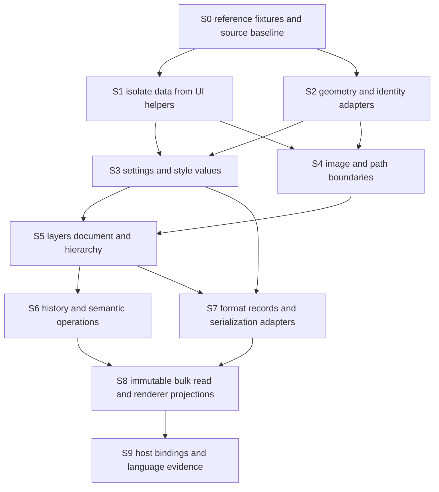

# Migration dependency map — semantic boundaries first

Stages below are future review units except the FilterKind and TextAlignment S1
slices, implemented 2026-10-01 (KST). Both are dependency-clean; Mac build/test
validation is pending. See the [first](filter-kind-migration.md) and
[second](text-alignment-migration.md) records. No other slice is started.
Based on main-sync merge `db268a2b`, containing main `ccf062ed` and its v12 data in
[repository-evidence.md](repository-evidence.md). Neither language nor GPU is
selected. Follow [core-api.md](../core-api.md) and the corrected
[type inventory](document-model-inventory.md).

## Dependency graph

Arrows mean **prerequisite → consumer**. Some parallel branches can be prepared
independently; numerical order is not a demand to move all files in one patch.

This is an integration map, not a claim that image storage depends on the manifest
codec. `ImageRef` and `CorePath` can be designed/prototyped before record migration;
a format record can be separated before pixels are moved. Snapshot semantics are
defined now and constrain S4–S7; a renderer projection is integrated at S8, not
invented after all operations. No Windows UI or renderer implementation is a stage
of this documentation task.

## Actual type dependency examples

- `LayerTransform` stores geometry + `LayerSampling`; its affine helper currently
  calls `BrushRaster`, which must be an adapter/numerical seam.
- `LayerTextStyle` stores `LayerTextColorRun`, `LayerTextFontRun`, `TextAlignment`
  and geometry; `PaletteColor` is a convenience-method dependency, not a stored
  field in every effect/style.
- `EffectContour`/`EffectPattern`, `BevelEffect.Style/Technique` and blend data
  precede Bevel/Satin/PatternOverlay and extended legacy effects. These precede
  LayerEffects, its presence-based format gate and render projections. Numerical
  pattern origin/contour behavior constrains adapters, not a Core/GPU choice.
- `LayerAdjustment` stores `LevelsSettings`, `CurvesSettings`, HSV and other
  settings. Levels requires `LevelRange`/`LevelsChannel`; Curves requires
  `CurvePoint`/`LevelsChannel`. These were missing from the previous graph.
- `ImageLayer` stores placement, blend, mask, content, adjustment, effects and
  shape/text wrappers. `CanvasDocument` stores layers, guides, profile and selection.
- `DocumentHistory.Snapshot` stores optional document + active layer + state UUID;
  its accounting traverses `ImportedImage.image/thumbnail`.
- `ProjectManifest` stores `ProjectLayerRecord` + guides. `ProjectSnapshot` adds
  image/mask dictionaries; it is not the complete UI/renderer snapshot contract.
- `LayerHierarchy` currently consumes format records and returns entries containing
  those records. Separate minimal hierarchy data to avoid a shared model → Formats
  → shared model dependency cycle.
- `ImportedImage → RasterSnapshot → BrushPatch` are existing Mac storage references.
  They stay behind the Mac adapter. Shared `ImageRef` does **not** depend on those
  concrete classes; only the adapter implementing it does.

## Stages, tests and rollback

| Stage | Files/types involved | Prerequisite | Expected Mac impact | Windows benefit | Required evidence/tests | Rollback point |
|---|---|---|---|---|---|---|
| S0 | ProjectStore, HistoryTests, GroupingSelectionTests, LayerStyleTests, existing C references; sync ledger | Pin synchronized db268a2b/main ccf062ed | No migration; characterize imported reference results | Comparable semantics, no toy-model assumptions | `.comp` v1–12 records/pixels, save11/12 presence gate, no-op/undo/save-preview races, style duplicate/paste/group coverage | Fixtures only; production untouched |
| S1 | FilterKind/TextAlignment data in Document and display extensions in UI: dependency-clean; other enums planned | S0 tests for each chosen slice; Mac evidence still pending for both | Same module/raw values/callers; native alignment mapping unchanged | Two data declarations without Apple dependencies | FilterKindTests/TextAlignmentTests, separate standalone typechecks and lexical guard; existing filter/text/PSD + full Mac suite | Rejoin each enum/helper in Filters.swift or TypeTool.swift |
| S2 | CoreScalar/Point/Size/Rect/Transform candidates; LayerTransform numerical functions; UUID adapter | Geometry/ID contract and S0 | Conversions at existing call sites, preserve degree/rounding/flip semantics | No CoreGraphics coordinates or spike UInt64 assumption | Transform/MaskTransform/Distort/Crop tests; UUID/filename and typed-number fixtures | Keep old stored fields until each adapter proves parity |
| S3 | A/B settings; nine effects, Contour/Pattern/Bevel enums and Fill Opacity; shape/text styles; Levels/Curves | S1; S2 where geometry required; style enum dependencies before records | Split rendering methods without changing values/defaults/optional presence | Portable complete v12 settings | Existing adjustment/text/shape tests + LayerStyleTests/PSDExportTests; nil/explicit-default and disabled effects | One type family's facade routes back to original implementation |
| S4 | ImageRef/CorePath adapters; ImportedImage/RasterSnapshot/BrushPatch remain Mac; LayerMask and selection coverage | Ownership/thread rules; S2 geometry | Adapter adds lifetime boundary; pixel/raster algorithms stay | Images/paths can cross platform without Apple objects | TiledLayer/RasterSnapshot/History, mask/feather/selection/holes tests; retained resource counts and close-with-snapshot | Existing asset/path fields retained behind facade; no storage replacement required |
| S5 | ImageLayer, CanvasDocument, CanvasGuide, profile, LayerOrder/Hierarchy/Opacity/LiveMaskGraph | S3 values + S4 resources; S2 identities | Isolate state/derived hierarchy, including hidden lower clipping base; retain UI edit context | Shared document meaning and stable IDs | Group/GroupingSelection/LiveMask/LayerAppearance tests, invalid graphs/duplicate IDs, lower vs external/upper live mask visibility | Keep current EditorSession-backed facade; one operation area at a time |
| S6 | DocumentHistory; EditorSession begin/end/restore; style commit; duplicate/delete/move/group | S5 complete state; partial-import/batch policy; Q16 preview/save characterization | Preserve sharing, active layer, saved state, one style OK step/Cancel restore; dialog pages stay UI | Atomic operations and full-style undo | History/LayerStyleTests, new v12 duplicate/paste/group evidence, no-op redo, nested/failed/stale operations, preview-save-cancel traces | Existing history/command path remains selectable until equivalent |
| S7 | ProjectManifest/LayerRecord/Snapshot; EditorSession+Projects; ProjectStore/Controller; PSD style/text service | S3/S5 records and validated state; image codec adapter when pixels involved | Keep actor/filesystem/PNG/atomic write and current presence-based 11/12 policy; no schema extension | Same v1–12 records and explicit PSD fallback policy | Project/Export/ExternalChange/ImageSize/LayerStyle/PSDExport tests; malformed versions/assets, disabled/default v12 fields, editable vs flattened PSD | Old ProjectStore/mapping remain reference; no file conversion |
| S8 | Bulk snapshot, layer-table/render facade; nine styles, Fill Opacity, pattern origin | S5/S6 stable lifetime/state tokens; S7 save projection checked; style field completeness | Retained immutable reads; legacy Metal/new CPU style paths and caches stay Mac | One linear bulk boundary with complete v12 description | Same-generation UI/render/save, stale/close cases, 500/2k/10k measurements, mask/style order/fill/tiled pattern parity | Adapter returns existing state snapshots; keep renderer implementations |
| S9 | Candidate host bindings, build/test harness and actual extracted slice | S8 semantic evidence; resolve relevant Q1–Q16 | No model replacement until separate review/parity evidence | Language comparison against identical boundary | C#/C++/Swift host lifetime/error tests, Windows/macOS CI, deployment closure, no pixel copies | Experimental target remains unlinked to product; preserve original spike |

The C pixel layer already has its own independent shared-C build; it does not wait
for the model chain. New reference coverage may be a separate test-only change.
S0–S9 remains valid after this sync; v12 expands the payload and tests at existing
stages rather than adding an earlier rewrite. Main synchronization is a recurring
maintenance lane before each affected migration, not a one-time completed stage.
Future syncs must preserve platform work and review incoming semantics separately.

## First migration status and next review

**FilterKind data/display split is implemented** in `9bac5cf`. Cases, raw values,
ordering, two classification properties and display literals are preserved. It
remains in the Mac app module and selects neither Core language. Local source-parity,
boundary and shared-C checks pass; standalone Swift typecheck, new FilterKindTests
and full Mac tests are delegated to verify.yml, whose result is not yet verified.

Main advanced to `0be4fe6` after the last sync: text family helpers, keyboard input,
tests and packaging. The inspected delta does not change FilterKind or its callers'
filter behavior; no merge was performed. Review it before a later text-related
slice. The TextAlignment delta was reviewed again before the second split; its
declaration, alignment persistence and mappings are unaffected by those main changes.
No main merge occurred.

**TextAlignment split is implemented** in `78cf0e9`, preserving Codable wire strings
Left/Center/Right and existing paragraph/PSD consumers. Added enum/style JSON and
native paragraph mapping tests; runtime Mac results are pending. ColorRange and
LayerEffectKind remain unstarted. Stop after TextAlignment. A product API skeleton
needs separate scope and ownership/snapshot/threading/error evidence; these two
small declaration splits alone do not validate those contracts.

## Isolated CoreBoundary evidence lane

[CoreBoundary](../../Spikes/CoreBoundary/README.md) now validates synthetic bulk
snapshots, ownership/release, StateID/Generation, serialized mutations and domain
errors independently of product migration. It is outside all product targets.
S0–S9 dependencies are unchanged: this is early evidence for S4/S6/S8/S9, not their
completion. Mac CI for S1 remains unverified. Real resources, complete history,
ABI/host handoff and renderer projections remain unvalidated. Rollback consists of
removing the isolated experiment and its evidence notes; no Mac behavior is touched.
Stop after this spike. Any API skeleton requires a separately scoped task.

## Minimal product read surface follows the experiment

[Product boundary](product-read-boundary.md) adds only immutable metadata types
and a one-way MainActor adapter from existing CanvasDocument. Existing S0–S9
prerequisites remain: this is an additive landing point for S5/S8, not completion
of those stages. There is no publisher, write boundary or renderer consumer.

Validated in spike: synthetic tokens/lifetime/concurrency/errors. Product read-path:
source and dependency checks passed, actual model tests authored but Mac execution
unverified. Remaining gate: Mac CI, token lifecycle owner and actual resource/history
semantics. Rollback removes the additive types/adapter/tests and guard additions;
existing Mac call sites and persisted data need no changes. No next migration starts.

## Publication/render audit gate

[Inventory and lifecycle](render-data-inventory.md) now identify S6/S8 prerequisites:
session instance epoch and publication coordinator, committed/preview envelope,
clipping/dependency closure, ancestor masks, document-specific color and immutable
resource ownership. S0–S9 ordering remains valid. Model metadata does not become a
render description by adding cached GPU values. A render request handles scale/view/
purpose independently of Generation; cache result provenance needs separate rules.

Mac target membership is statically confirmed; runtime CI remains unverified.
A separately scoped unlinked semantic projection prototype may use placeholders;
product renderer linkage still needs publication/resource and Mac parity evidence.
No mutation, renderer or GPU implementation starts here.
