# Migration dependency map

Which parts of the document model must reach the shared Core before which, for the plan in
[document-model-inventory.md](document-model-inventory.md). A type can't move until every type it **stores** has
moved, and until the foundations it needs (Core geometry, the ID policy, `ImageRef`, `CorePath`) exist. Edges below are
the stored-property references found in the code (1.4.2), not guesses. Nothing here has been moved.

## Foundations

| Foundation | Defined in | Unblocks |
|---|---|---|
| **F0 Golden `.comp` tests** | inventory step 0 | every step that touches a saved type |
| **F1 Core geometry** (`Scalar`, `CorePoint`, `CoreSize`, `CoreRect`, `CoreTransform`, `CoreColor`) | core-api §2, step 2 | `LayerTransform`, effects, shape/text styles, `PaletteColor` |
| **F2 ID policy** | core-api §6, architecture-questions Q1, step 3 | `CanvasGuide`, `ImageLayer`, `CanvasDocument`, manifest types |
| **F3 `ImageRef`** | core-api §7.4, step 4 | `ImageLayer`, `LayerMask`, `ProjectSnapshot`, `DocumentHistory`, `LayerShape`, `LayerText` |
| **F4 `CorePath`** | core-api §2, step 5 | `DocumentSelection`, `ShapeKind` path building |
| **F5 Operations out of `EditorSession`** | core-api §5, step 6 | the Core's public surface; the bulk/snapshot API |

## Graph

Arrows point from a type to what it needs first. Colors: A (move as is), B (platform types out first), C (adapter
first), D (stays platform), F (foundation).

```mermaid
flowchart BT
  classDef A fill:#d9f2d9,stroke:#3a7d3a,color:#000
  classDef B fill:#fff1c2,stroke:#a07d00,color:#000
  classDef C fill:#ffd9cc,stroke:#b34700,color:#000
  classDef D fill:#e0e0e0,stroke:#666,color:#000
  classDef F fill:#dbe8ff,stroke:#2f5fb3,color:#000

  F0[F0 golden .comp tests]:::F
  F1[F1 Core geometry]:::F
  F2[F2 ID policy]:::F
  F3[F3 ImageRef]:::F
  F4[F4 CorePath]:::F
  F5[F5 operations out of EditorSession]:::F

  CanvasDocument:::C --> ImageLayer & DocumentSelection & CanvasGuide & DocumentColorProfile & LayerOrder & F2
  ImageLayer:::C --> LayerTransform & LayerBlendMode & LayerMask & LayerAdjustment & LayerEffects & LayerShape & LayerText & F3 & F2
  DocumentHistory:::C --> CanvasDocument & F3
  ProjectSnapshot:::C --> ProjectManifest & F3
  ProjectManifest:::B --> ProjectLayerRecord & CanvasGuide & F0 & F2
  ProjectLayerRecord:::B --> LayerTransform & LayerBlendMode & LayerAdjustment & LayerEffects & LayerShapeStyle & LayerTextStyle & F0
  DocumentSelection:::C --> F4
  LayerMask:::C --> LayerTransform & F3
  LayerShape:::C --> LayerShapeStyle & F3
  LayerText:::C --> LayerTextStyle & F3
  LayerTransform:::B --> LayerSampling & F1
  LayerAdjustment:::B --> AdjustmentKind & HueSaturationSettings & ExposureSettings & GradientMapSettings & GrainSettings & BlackWhiteSettings & ColorBalanceSettings
  AdjustmentKind:::B --> FilterKind
  GradientMapSettings:::B --> AdjustmentColor
  HueSaturationSettings:::A --> ColorRange & HueBand & RangeAdjustment
  LayerEffects:::B --> StrokeEffect & ShadowEffect & ColorOverlayEffect & InnerShadowEffect & OuterGlowEffect & InnerGlowEffect & LayerEffectKind
  StrokeEffect:::B --> PaletteColor
  ShadowEffect:::B --> PaletteColor
  ColorOverlayEffect:::B --> PaletteColor
  InnerShadowEffect:::B --> PaletteColor
  OuterGlowEffect:::B --> PaletteColor
  InnerGlowEffect:::B --> PaletteColor
  LayerShapeStyle:::B --> ShapeKind & PaletteColor
  ShapeKind:::B --> F4
  LayerTextStyle:::B --> LayerTextColorRun & LayerTextFontRun & TextAlignment & PaletteColor
  LayerTextColorRun:::B --> F1
  PaletteColor:::B --> F1
  CanvasGuide:::A --> F2
  F3 --> ImportedImage:::D
  ImportedImage --> RasterSnapshot:::D
  RasterSnapshot --> BrushPatch:::D
  F5 --> CanvasDocument & DocumentHistory

  class LayerSampling,LayerBlendMode,LayerEffectKind,FilterKind,ColorRange,HueBand,RangeAdjustment,AdjustmentColor,LayerTextFontRun,TextAlignment A
  class ExposureSettings,GrainSettings,BlackWhiteSettings,ColorBalanceSettings,DocumentColorProfile,LayerOrder B
```

`F3 → ImportedImage`: the macOS implementation of `ImageRef` wraps `ImportedImage`, which stays in the platform
layer (D) with `RasterSnapshot` and `BrushPatch`.

## Waves

Each wave only needs earlier waves. Within a wave, items are independent and can be separate reviewable changes.

| Wave | Contents | Needs | Plan step |
|---|---|---|---|
| 0 | F0 golden `.comp` tests | — | 0 |
| 1 | File moves: all **A** types (`LayerSampling`, `LayerBlendMode`, `LayerEffectKind`, `FilterKind`, `HueSaturationSettings`, `ColorRange`, `HueBand`, `RangeAdjustment`, `AdjustmentColor`, `LayerTextFontRun`, `TextAlignment`); splitting `apply(CGImage)`/`path(in:)`/UI helpers out of model files (E6, E7), which frees the adjustment settings, `AdjustmentKind` and `LayerAdjustment` (they need no geometry) | — | 1 |
| 2 | F1 Core geometry; then `PaletteColor` → `CoreColor`, `LayerTransform`, `LayerTextColorRun` | 1 | 2 |
| 3 | The six effects, `LayerEffects`, `LayerShapeStyle`, `LayerTextStyle` (they store colors) | 2 | 2 |
| 4 | F2 ID policy; `CanvasGuide`; `LayerOrder` (E4); `DocumentColorProfile` → `ColorSpaceID`; `ProjectLayerRecord`, `ProjectManifest` | 0, 3 | 3 |
| 5 | F3 `ImageRef`; `LayerMask`, `LayerShape`, `LayerText` (E1), `ProjectSnapshot`, E2, E3 | 4 | 4 |
| 6 | F4 `CorePath`; `DocumentSelection`, `ShapeKind` path building | 1 | 5 |
| 7 | `ImageLayer`, `CanvasDocument`, `DocumentHistory` | 5, 6 | 4–5 |
| 8 | F5 operations out of `EditorSession` (E5); then the snapshot/bulk API and C ABI | 7 | 6–7 |

The longest chain — geometry → effects/styles → manifest records → `ImageRef` → `ImageLayer` → `CanvasDocument` →
operations — is the critical path. `CorePath` (wave 6) is off it and can go in parallel with waves 2–5.

## Risk by wave

| Wave | Risk | Guard |
|---|---|---|
| 1 | Low: moves and splits only | Build + all tests; boundary check on model files |
| 2–3 | `.comp` numbers written differently (e.g. float formatting) | F0 golden tests byte for byte |
| 4 | ID encoding changes (case, format) | F0 golden tests; IDs in file names |
| 5 | Undo memory (sharing must survive the handle); render caches keyed on image identity | HistoryTests, memory budget test, TiledLayerTests |
| 6 | Selection edge cases (empty vs none, feathering, winding) | SelectionTests, SelectionFeatherTests, MagicWandTests |
| 7–8 | Behavior of every layer command | The whole suite; new operation-level tests written first |
